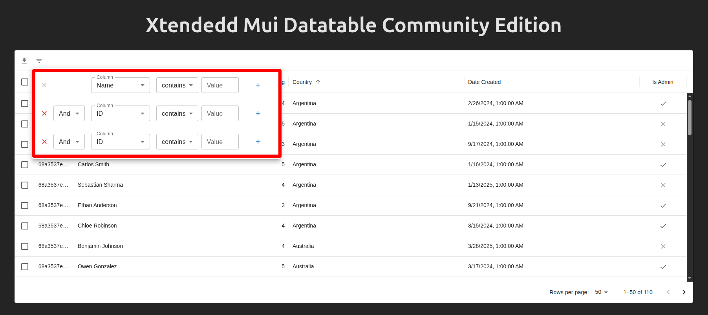

# 📊 Extended MUI-X DataGrid (Community Edition) 

This project extends the **[MUI DataTable (Free Version)](https://mui.com/x/react-data-grid/)** by adding missing but important features for real-world applications such as **advanced filtering, server-side sorting, and pagination integration**.

---

---

## ✨ Features

- 🔍 **Advanced Filtering**  
  - Complex filters with multiple fields, operators (`=`, `>`, `<`, `contains`, etc.), and logic operators (`and`, `or`).  
- 📑 **Server-Side Pagination**  
  - Support for `limit` and `offset` in API calls.  
- ↕ **Multi-Column Sorting**  
  - Pass sort instructions to the backend in a structured format.  
- 🌐 **REST-Friendly Query Encoding**  
  - Automatically encodes filter/sort objects into URL query parameters for GET requests.  
- ⚡ **Plug-and-Play Utility**  
  - Works with Axios or any fetch utility for smooth integration with APIs.  
- 🛠️ **TypeScript Support**  
  - Strongly typed utilities for safer integration in React + TS projects.

---

## ❓ Why This Repo?

The original **Mui-x Data Grid Free Edition** has some limitations:
- ❌ Lacks support for **complex filtering logic** (multiple columns with `and/or` linkOperator).  
- ❌ Lacks support for **complex sorting logic** (multiple column sort with `and/or` linkOperator`).  


This repo **fills the gaps** by:
- ✅ Adding advanced filter + sort utilities for server-side APIs.  
- ✅ Providing a clean way to encode/decode queries.  
- ✅ Ensuring compatibility with REST and GraphQL backends.  
- ✅ Writing everything with **TypeScript-first** design.  

---

## 📦 Installation

```bash
npm install dialeth-datagrid-mui-x

# install dependencies
npm install @mui/material @emotion/react @emotion/styled
npm install @mui/x-data-grid

```

---

## 🚀 Usage

### 1. In your React project

```tsx
import React from "react";
import XtendedMuiGrid from "dialeth-datagrid-mui-x";
import type { FilterPayloadDef } from "dialeth-datagrid-mui-x";
import type { GridColDef } from "@mui/x-data-grid";

import { Request } from "./utils/request";


function App() {

  const [gridData, setGridData] = React.useState<Record<string, any>>({});
  const columns: GridColDef[] = [
    {
      field: "_id",
      headerName: "ID",
      width: 100,
    },
    {
      field: "name",
      headerName: "Name",
      width: 150,
      flex: 1,
    },
    {
      field: "rating",
      headerName: "Rating",
      type: "number",
      width: 100,
      valueGetter: (value:any) => {
        if (!value) {
          return value;
        }
        // Convert the decimal value to a percentage
        return Math.round((value * 5) / 100);
      },
    },
    {
      field: "country",
      headerName: "Country",
      width: 150,
  
      flex: 1,
    },
    {
      field: "dateCreated",
      headerName: "Date Created",
      type: "dateTime",
      width: 180,
      flex: 1,
      valueGetter: (value:any)  =>{
        if (!value) {
          return value;
        }
        // Convert the date string to a Date object
        return new Date(value);
      }
    },
    {
      field: "isAdmin",
      headerName: "Is Admin",
      type: "boolean",
      width: 120,
    },
  ];
  
  const defaultFilter = [{field: "name", operator: "contains", value: ""}];

  const handleFilterChange = async (payload: FilterPayloadDef) => {
    const res: any = await fetch(`http://localhost:5000/api/player?${payload.toString()}`);
    const data = await res.json();
    setGridData(data);
    console.log("Data fetched:", data);
  };
  
  const handleExport = async (payload: FilterPayloadDef, fileType: "csv" | "excel") =>{
    console.log("payload: ", payload);
    console.log("fileType: ", fileType);
    await Request.get(`/player/download/${fileType}`, payload);
  }

  return (
    <>
      <div className="App">
        <h1>Xtendedd Mui Datatable Community Edition</h1>
        <XtendedMuiGrid
          columns={columns}
          defaultFilter={defaultFilter}
          gridData={gridData}
          handleFilterChange={handleFilterChange}
          //handleExport={handleExport}
          csvExportUrl="http://localhost:5000/api/player/download/csv"
          excelExportUrl="http://localhost:5000/api/player/download/excel"
        />
      </div>
    </>
  );
}


```

---

### 2. Request Payload Format

#### 🔹 POST (with payload)

```json
{
  "filter": {
    "items": [
      { "field": "name", "operator": "contains", "value": "Jane" },
      { "field": "age", "operator": ">", "value": "30" }
    ],
    "logicOperator": "and"
  },
  "sort": [
    { "field": "rating", "sort": "desc" },
    { "field": "name", "sort": "asc" }
  ],
  "limit": 30,
  "offset": 3
}
```

#### 🔹 GET (query params)

```
GET /api/players?
  filter=%7B%22items%22%3A%5B%7B%22field%22%3A%22name%22%2C%22operator%22%3A%22contains%22%2C%22value%22%3A%22Jane%22%7D%2C%7B%22field%22%3A%22age%22%2C%22operator%22%3A%22%3E%22%2C%22value%22%3A%2230%22%7D%5D%2C%22logicOperator%22%3A%22and%22%7D
  &sort=%5B%7B%22field%22%3A%22rating%22%2C%22sort%22%3A%22desc%22%7D%2C%7B%22field%22%3A%22name%22%2C%22sort%22%3A%22asc%22%7D%5D
  &limit=30
  &offset=3
```

---

## 🛠️ Development

Run the project locally:

```bash
npm run dev
```

Build the library:

```bash
npm run build
```

Run tests:

```bash
npm test
```

---

## 🤝 Contributing

Contributions are welcome! Please open an issue first to discuss your idea.  
- Fork the repo  
- Create your feature branch (`git checkout -b feature/amazing-feature`)  
- Commit changes (`git commit -m 'Add amazing feature'`)  
- Push branch (`git push origin feature/amazing-feature`)  
- Open a pull request  

---

## 📜 License

MIT © [Your Name](https://github.com/aymarc)
